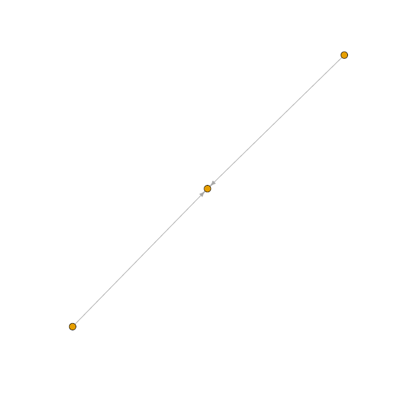

# medalla-data-challenge
Our submission for the 2020 Medalla Data Challenge

## Submission Links

- [#1: Proper Proposers and Skipped Slots: A Ranking and Segmentation Study of Validator Behavior](https://crypto.omnianalytics.io/2020/10/20/what-makes-a-top-tier-validator)
- [#2: The Art of Slashing](https://crypto.omnianalytics.io/2020/10/19/slasher-analysis)

[Learn about Eth 2.0 Validator Performance](https://crypto.omnianalytics.io/2020/10/20/what-makes-a-top-tier-validator)               | [Learn about "Slashings" on the Eth 2.0 Medalla Testnet](https://crypto.omnianalytics.io/2020/10/19/slasher-analysis)
:------------------------------------------------------:|:-------------------------:
    |

## About Us

[Omni Analytics Group](https://omnianalytics.io) is an incorporated group of passionate technologists who help others use data science to change the world. Our  practice of data science leads us into many exciting areas where we enthusiastically apply our machine learning, artificial intelligence and analysis skills. Our flavor for this month, the blockchain!  To learn more about what we do or just to have fun, join us over on [Twitter](https://twitter.com/OmniAnalytics).
